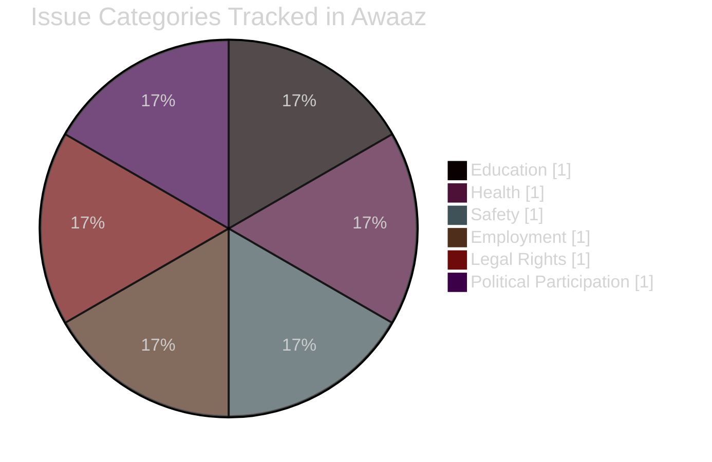
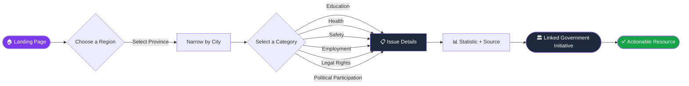
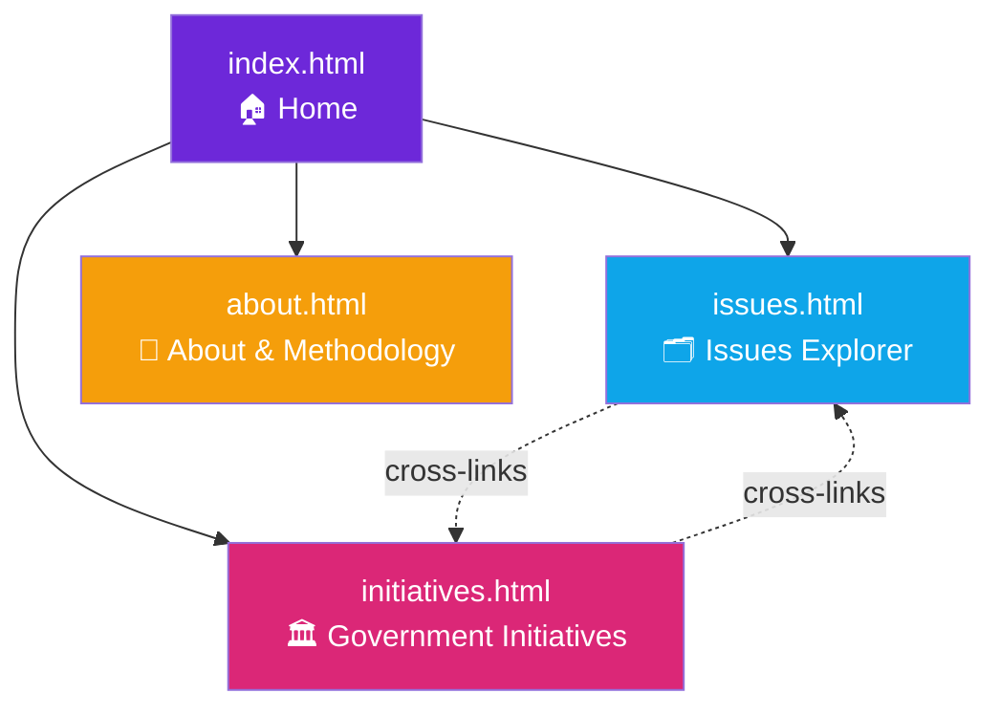

<div align="center">


<br/>

[](https://abdulhadi0-byte.github.io/Women_In_pakistan/index.html)
[](https://abdulhadi0-byte.github.io/Women_In_pakistan/index.html)
[](LICENSE)
[](#-tech-stack)


</div>

---

## 🎗️ About

**Awaaz** (*"Voice"* in Urdu) is a respectful, data-driven awareness portal that maps **women's issues across Pakistan** — by province and city — directly to relevant **laws, government programs, and official resources**. Built as an educational project focused on empathy, accuracy, and actionable information.

> Educational project — statistics should be verified and sourced before formal submission.

<br/>

<div align="center">

### 📊 Portal at a Glance

</div>

<div align="center">

| 🗺️ Regions Covered | 🏷️ Issue Categories | ⚙️ Stack | 🎯 Focus |
|:---:|:---:|:---:|:---:|
| **7** | **6** | **100% Vanilla JS** | Empathy · Accuracy · Action |

</div>

<br/>



<br/>

## ✨ Features

<table>
<tr>
<td width="50%">

### 🗂️ Issues Explorer
Filter and search real issues by **province**, **city**, and **category** in real time — no page reloads, no frameworks, pure JS filtering.

### 🏛️ Government Initiatives
Browse relevant **laws & programs**, cross-linked back to the issues they address, so users see the full picture: *problem → policy response*.

</td>
<td width="50%">

### 📖 About & Methodology
Transparent sourcing rules, disclaimers, and team credits — built with academic integrity in mind.

### 📞 Emergency Helplines
Quick access to **1099** (Ministry of Human Rights), **15** (Emergency), and **1122** (Rescue) — always visible in the footer.

</td>
</tr>
</table>

<br/>

## 🧭 How Awaaz Works



<br/>

## 🖥️ Site Structure



<br/>

## 🛠️ Tech Stack

<div align="center">


</div>

No frameworks, no build step, no dependencies — the entire filtering and routing logic runs on **vanilla JavaScript**, making the project lightweight, fast, and easy to audit.

<br/>

## 🚀 Getting Started

### Live Version
Just visit → **[abdulhadi0-byte.github.io/Women_In_pakistan](https://abdulhadi0-byte.github.io/Women_In_pakistan/index.html)**

### Run Locally

```bash
# Clone the repository
git clone https://github.com/abdulhadi0-byte/Women_In_pakistan.git

# Move into the project folder
cd Women_In_pakistan

# Open directly in your browser
open index.html      # macOS
start index.html      # Windows
xdg-open index.html   # Linux
```

No build tools, no `npm install` — just open and go. ⚡

<br/>

## 📂 Project Structure

```
Women_In_pakistan/
├── index.html          # Landing page
├── issues.html         # Issues Explorer (filterable by province/city/category)
├── initiatives.html    # Government Initiatives directory
├── about.html          # Methodology, disclaimers & credits
├── assets/
│   ├── css/             # Stylesheets
│   ├── js/               # Filtering & data logic
│   └── data/             # Issues & initiatives datasets
└── README.md
```

<br/>

## 🗺️ Roadmap

- [x] Province & city-based issue filtering
- [x] Government initiative cross-linking
- [x] Emergency helpline integration
- [ ] Add verified statistics with citation footnotes
- [ ] Dark/light theme toggle
- [ ] Multi-language support (Urdu 🇵🇰)
- [ ] Search bar across all categories
- [ ] Downloadable reports per region

<br/>

## 🤝 Contributing

Contributions are welcome! This started as a team assignment (AI Seekho — Assignment 3) and is open for improvement.

1. Fork the repo
2. Create your feature branch (`git checkout -b feature/amazing-feature`)
3. Commit your changes (`git commit -m 'Add amazing feature'`)
4. Push to the branch (`git push origin feature/amazing-feature`)
5. Open a Pull Request

<br/>

## 👥 Credits

Built by a **team of 3** for **AI Seekho — Assignment 3**.

<br/>

## 📜 License

Distributed under the **MIT License**. See `LICENSE` for details.

<br/>

## 📞 Emergency Helplines (Pakistan)

| Service | Number |
|---|---|
| Ministry of Human Rights | **1099** |
| Emergency | **15** |
| Rescue | **1122** |

<br/>

---

<div align="center">

### ⭐ If this project resonates with you, consider giving it a star!


</div>
